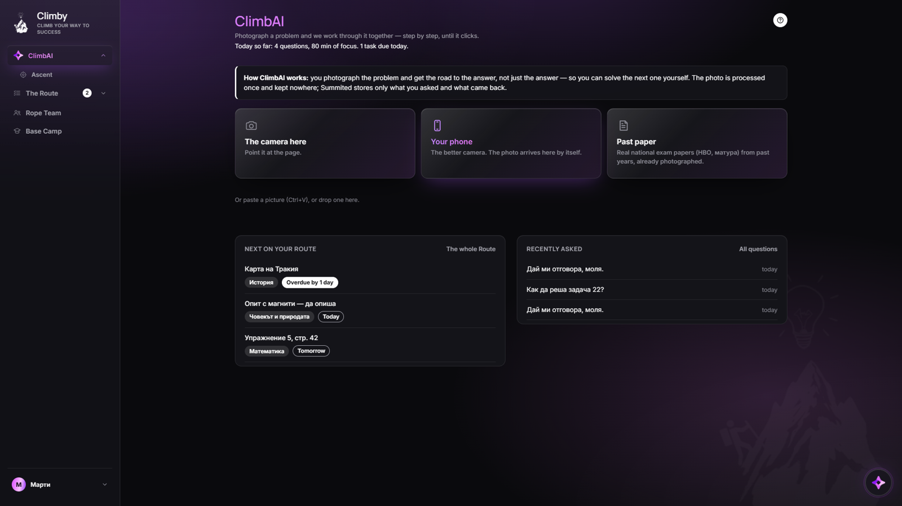
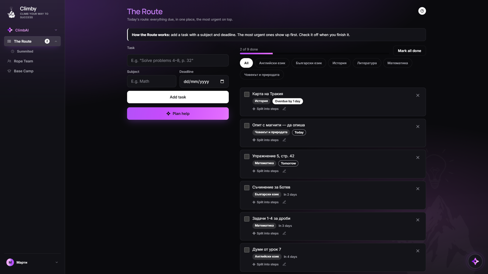
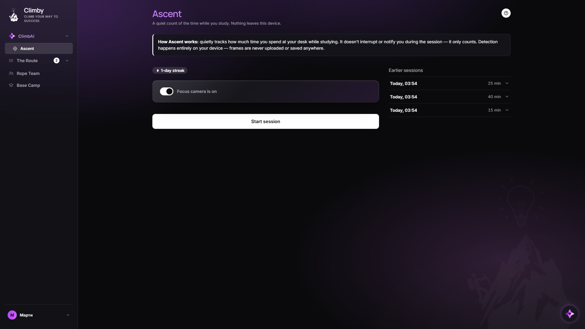
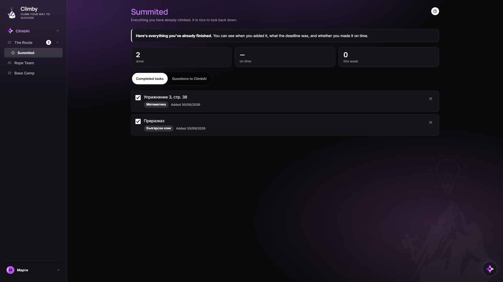
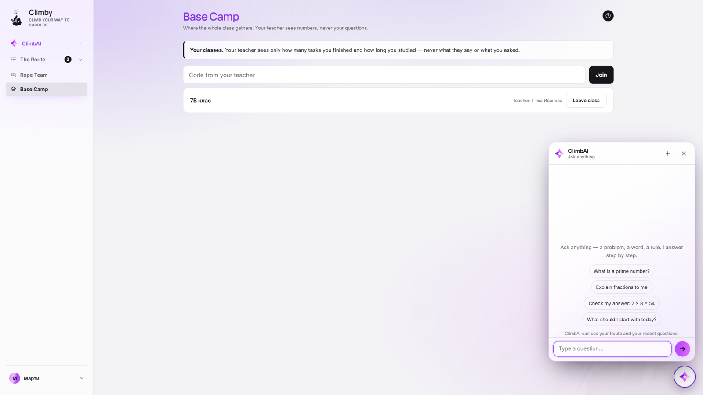
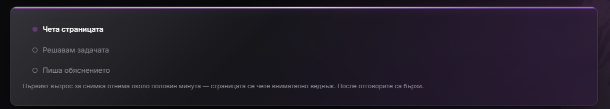
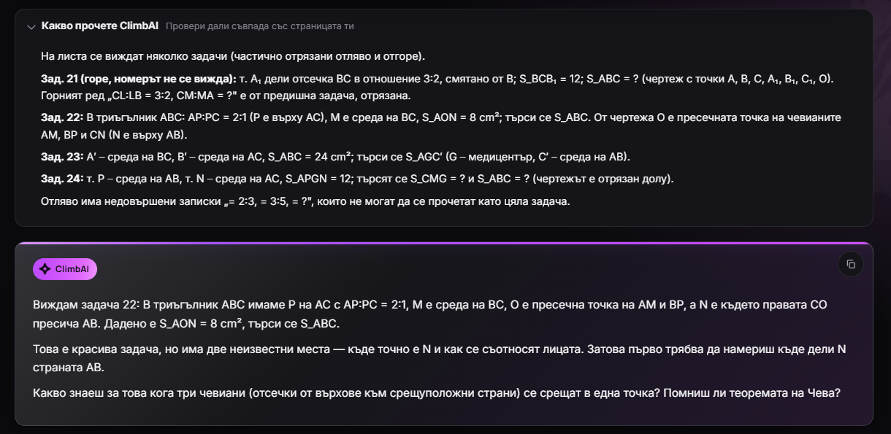
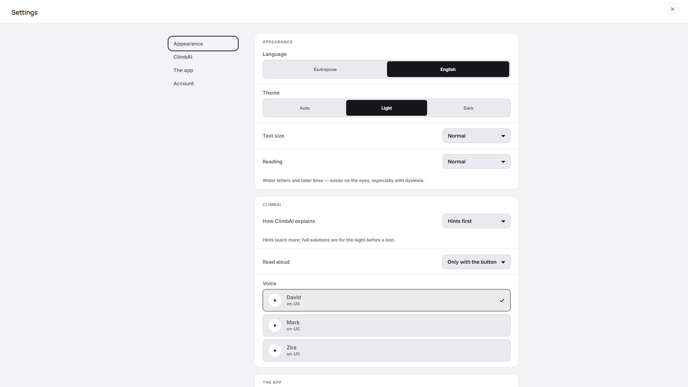

# Climby

**Climb your way to success.**

Climby is a study app for students aged 12 to 18, and for anyone who finds it
hard to stay with their homework. Photograph a problem from the textbook and
ClimbAI works through it with you, step by step, until it makes sense. Around it
sit the things a study evening actually needs: a list of what is due, a quiet
focus timer, a record of what is already done, and a way for a parent or a
teacher to see the numbers without seeing the work.

The app is in Bulgarian and English and installs on Windows.



---

## What's inside

| Screen | What it's for |
|---|---|
| **ClimbAI** | Photograph a page and ask. The answer explains the road, not just the result. Under the cards: what is next on your Route and what you asked lately. |
| **Ascent** | A quiet timer while you study, with the history of your sessions beside it. Presence detection runs entirely on your device — no image ever leaves it. |
| **The Route** | Today's homework, most urgent first, filterable by subject. A big task can be split into steps, and ClimbAI can suggest an order for the evening. |
| **Summited** | Everything you have finished and every question you asked — with three numbers on top: done, on time, this week. |
| **Rope Team** | A parent sees the numbers — how many tasks, how much time, how many days in a row. Never what is in them. |
| **Base Camp** | A teacher creates a class with a code and sees the same numbers for the whole class, and nothing more. |
| **Chat** | The circle in the corner opens ClimbAI over any screen, for "what is a prime number" rather than "check problem 7". It can see your Route, so "what should I start with?" means something. |

| The Route | Ascent |
|---|---|
|  |  |
| **Summited** | **Chat, light theme** |
|  |  |

---

## How ClimbAI answers a photographed page

A page of handwritten Bulgarian geometry is hard to read and harder to solve.
The fast model that carries the conversation could do neither; the strongest
model could do both, but is too slow and too expensive to run on every reply.
So the two are split:

```
photos ──▶ Opus 5 reads the page, once ──▶ stored as a "brief" ──▶ Haiku 4.5 tutors from it
typed  ──▶ Haiku 4.5, with Opus on call as an advisor, at most once per message
```

1. **The first question** sends the photographs. Opus 5 writes down everything on
   the page — every problem, every number, what is cut off — and, for maths,
   physics and chemistry, a worked solution to the problem that was asked,
   explained for a grade-appropriate method. The app shows three steps while
   this happens (it takes about half a minute).
2. **What was read is shown to the student**, folded above the answer, so a
   misread number is caught before the explanation built on it is believed.
   The worked solution is never sent to the app.
3. **Every reply after that** names the page by its id instead of uploading it
   again. Replies take seconds.
4. **Hints first.** The tutor holds the solution back and asks for the next
   step. If the student asks for the answer, they get it — fully explained.
5. **Web search** is available for methods and facts. Sites that publish answer
   keys to Bulgarian and Russian textbooks (решебници, ГДЗ) are blocked.

If the reading fails for any reason — an error, a refusal, a timeout — the
tutor reads the photographs itself, as it did before. The student never sees
the relay fail.

| Reading the page | What ClimbAI read, and the first hint |
|---|---|
|  |  |

Measured on a real photograph (problem 22, a cevian area problem, answer
30 cm²): first answer in about 40 seconds, a follow-up asking for the full
solution in 6 seconds, about six cents per page. The design and the numbers are
in [`docs/superpowers/specs/2026-09-29-study-relay-design.md`](docs/superpowers/specs/2026-09-29-study-relay-design.md).

### Three ways to get a page in

- **The camera** on the computer, with a live outline of the page and corner
  adjustment before sending.
- **Your phone.** Show a QR code to the phone once, confirm that both screens
  show the same code, and from then on every photo taken on the phone appears
  on the computer by itself. The phone's key can upload a photo and nothing else.
- **Past exam papers.** The national exams (НВО, матура) from past years, already
  photographed. Pick the year and the page; name the problem; ask.

Or paste a screenshot (Ctrl+V), or drop an image on the screen.

---

## Settings

Language, theme (auto, light, dark), text size, a wider easy-reading layout, how
ClimbAI explains (hints first or full solutions), reading answers aloud and the
voice, linked phones, and the account itself: profile, password, a download of
everything Climby keeps about you, and deleting the account for good.



---

## Installing

1. Download `Climby-Setup-X.Y.Z.exe` from [Releases](https://github.com/Marun1105/my-project/releases).
2. Run it.

Windows may show a blue **"Windows protected your PC"** screen — the app has no
paid code-signing certificate; it is not a virus. Click **More info → Run anyway**.

From then on Climby updates itself: it checks on launch, downloads quietly, and
asks when to restart. You can sign in with an email and password, or with Google.

---

## Privacy

This is an app for young people, so the lines are drawn deliberately and in one place:

- **Photos sent to the AI are not kept.** What is kept from a photographed page is
  the text that was read off it and, for maths, physics and chemistry, the worked
  solution — both deleted with the account and included in the data download.
  History keeps the text of the question and the answer.
- **One exception, for seconds:** a photo from a linked phone sits in the database
  until the computer collects it — usually a second or two, ten minutes at most.
- **The presence camera uploads nothing.** "Is there a face in front of the
  screen" is decided entirely in the browser. It counts attention, not emotion.
- **Parents and teachers see numbers, not content.** How many tasks, how many
  minutes, how many days in a row. Never what a problem said or what was asked.
- **No trackers, no advertising.** The only things stored in the browser are the
  sign-in and the settings on this device.

The fourth one is not a technical limitation; it is a decision. A student who
knows every question is being read stops asking honestly — and asking is the
whole point.

---

## For developers

### Inside

- **Backend:** FastAPI + SQLAlchemy. Postgres (Neon) in production, SQLite locally.
- **Frontend:** plain HTML, CSS and JavaScript — no framework, no build step.
- **Desktop:** Electron + electron-builder, updates through GitHub Releases.
- **AI:** Anthropic Claude — Opus 5 reads photographed pages and advises; Haiku 4.5
  tutors, plans and splits tasks. See `relay.py`.

### Running locally

```bash
pip install -r requirements.txt
python -m uvicorn server:app --reload          # backend, on :8000
cd frontend && python -m http.server 8001      # frontend, on :8001
```

Open `http://localhost:8001`. The backend address picks itself: opened from
localhost, the app talks to localhost.

Environment variables: `ANTHROPIC_API_KEY` and `JWT_SECRET` are required.
Optional: `DATABASE_URL` (otherwise SQLite), `RESEND_API_KEY` and `RESEND_FROM`
(email), `GOOGLE_CLIENT_ID` and `GOOGLE_CLIENT_SECRET` (Google sign-in),
`TWILIO_*` (SMS), `PAPERS_CACHE_DIR`, `AI_DAILY_TOKEN_CAP` (the whole app's daily
AI budget in tokens; default 3,000,000, 0 for none).

`python seed_demo_accounts.py` makes a student, a parent and a teacher account on
the local database, so every screen can be opened without registering.

### Tests

```bash
python -m pytest -q          # backend and static frontend checks
cd desktop && npm run pagecheck   # the real page in headless Chromium
```

No test reaches the real AI: `conftest.py` replaces the key and makes every
unstubbed model call fail. The static checks cover every translation existing in
both languages, every id JavaScript looks for existing in the HTML, the service
worker caching every local script, and the backend address pointing at production.

### Shipping

**Pushing to `main` deploys the backend** through the GitHub Action in
`.github/workflows/deploy-backend.yml`. A build can take several minutes; the old
version keeps serving until the new one is ready. Unfinished work belongs on a
branch. `/healthz` reports the database and the day's AI usage.

The desktop app is a separate step — see [`desktop/RELEASE.md`](desktop/RELEASE.md):
bump the version in `desktop/package.json`, build, confirm `latest.yml` describes
exactly that file, and press **Publish release** — a draft is invisible to
installed copies. Frontend changes reach people only through a new desktop build;
`phone_page.html` ships with the backend.

### Notes

- [`docs/plan-2026-09-climby-2.md`](docs/plan-2026-09-climby-2.md) — the plan for Climby 2: competition, friends and groups, memory, with every line traced to who asked for it.
- [`docs/superpowers/specs/2026-09-29-study-relay-design.md`](docs/superpowers/specs/2026-09-29-study-relay-design.md) — the study relay: decisions, measurements, failure handling.
- [`docs/review-2026-09.md`](docs/review-2026-09.md) — a full product review.
- [`docs/ai-v-ucheneto.md`](docs/ai-v-ucheneto.md) — what the research says about AI's benefit and harm in learning.
- [`docs/proba-s-istinski-telefon.md`](docs/proba-s-istinski-telefon.md) — twenty minutes with a real textbook.
- [`docs/baza-danni.md`](docs/baza-danni.md) — why the database is on Neon.
